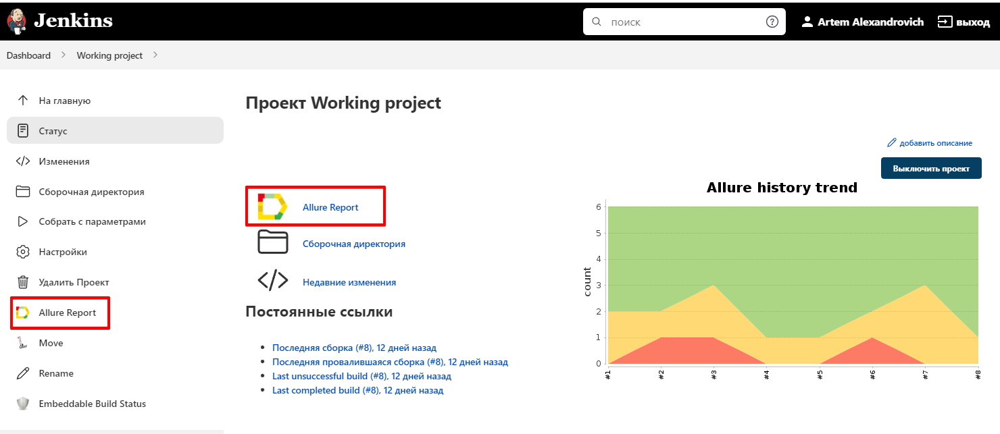
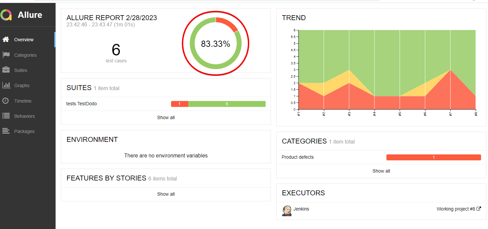
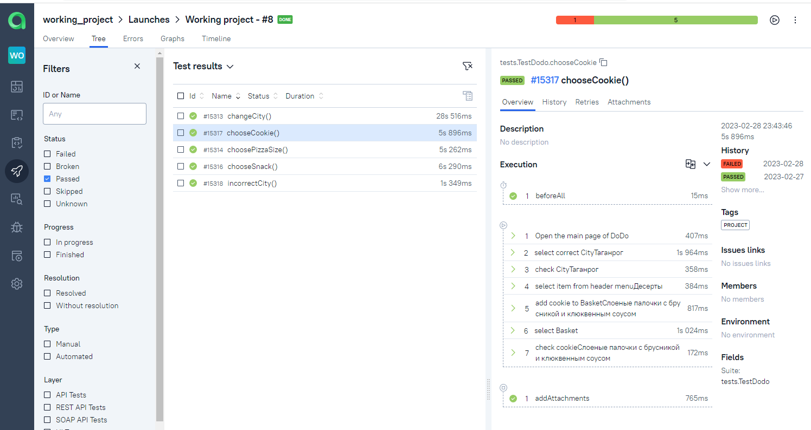
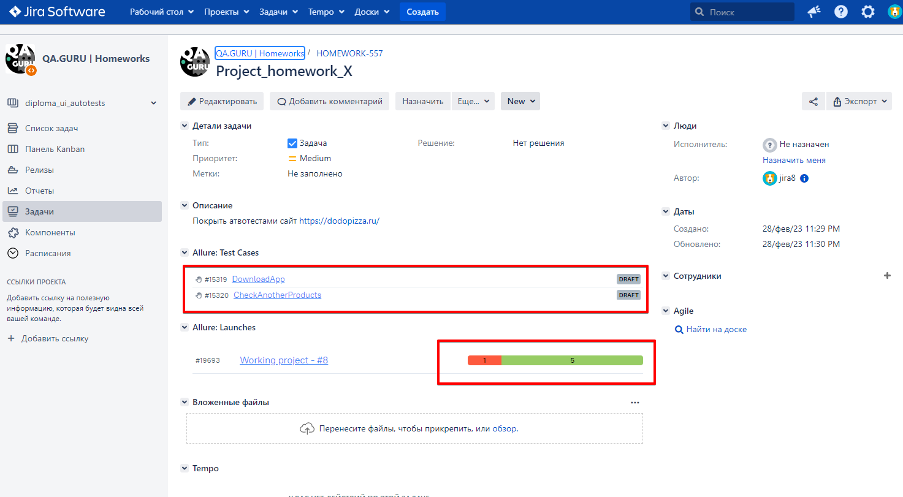
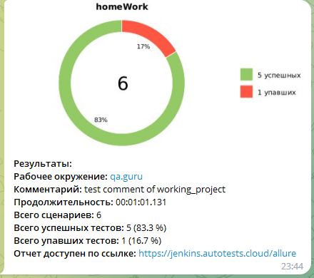

## Automated tests for https://dodopizza.ru/
<a name="Ссылка"></a>
## Content

- <a href="#tools">Stack of technologies</a>
- <a href="#tests">List of checks</a>
- <a href="#run">Running tests from the terminal</a>
- <a href="#remote">Remote running tests</a>
- <a href="#jenkins-report">Running tests in Jenkins</a>
- <a href="#allure-report">Test results report in Allure Report</a>
- <a href="#allure-testops">Integration with Allure TestOps</a>
- <a href="#jira">Integration with Jira</a>
- <a href="#telegram">Integration with Telegram</a>

<a id="tools"></a>
## :bookmark_tabs: Stack of technologies

<p  align="center">

<code></code>
<code></code>
<code></code>
<code></code>
<code></code>
<code></code>
<code></code>
<code></code>
<code></code>
<code></code>
<code></code>
<code></code>
</p>

<a id="tests"></a>
## :bookmark_tabs: List of checks:
## E2E Tests

- [x] City Selection Check
- [x] Checking for wrong city selection
- [x] Checking the choice of three pizzas
- [x] Dessert Selection Check
- [x] Checking the selection of snacks
- [x] Checking pizza size selection

<a id="run"></a>
## :computer: Running tests from the terminal

```bash
gradle clean project_test
```

<a id="remote"></a>
### Remote running tests

```bash
clean
project_test
-Dremote=${SELENOID_URL}
-Dbrowser_version=${BROWSER_VERSION}
-Dbrowser=${BROWSER}
-Dbrowser_size=${BROWSER_SIZE}
```

<a id="jenkins-report"></a>
##  Running tests in [Jenkins](https://jenkins.autotests.cloud/job/pilulka/)

After completing all the settings, you need to click on the button <code><strong>*Собрать с параметрами*</strong></code> and build will be started.
When the assembly is completed, the allure report becomes available.

<p align="center">
  
</p>


<a id="allure-report"></a>
##  Test results report in [Allure Report](https://jenkins.autotests.cloud/job/pilulka/30/allure/)

<p align="center">
  
</p>

<a id="allure-testops"></a>
##  Integration with [Allure TestOps](https://allure.autotests.cloud/launch/18709)

## Test-cases

<p align="center">
  
</p>

<a id="jira"></a>
##  Integration with [Jira](https://jira.autotests.cloud/browse/HOMEWORK-490)

<p align="center">
  
</p>

<a id="telegram"></a>
##  Telegram notifications using a bot
After passing all the tests, an automatic report is sent to the <code>Telegram</code> messenger

<p align="center">

</p>

[Вернуться к оглавлению ⬆](#Ссылка)
